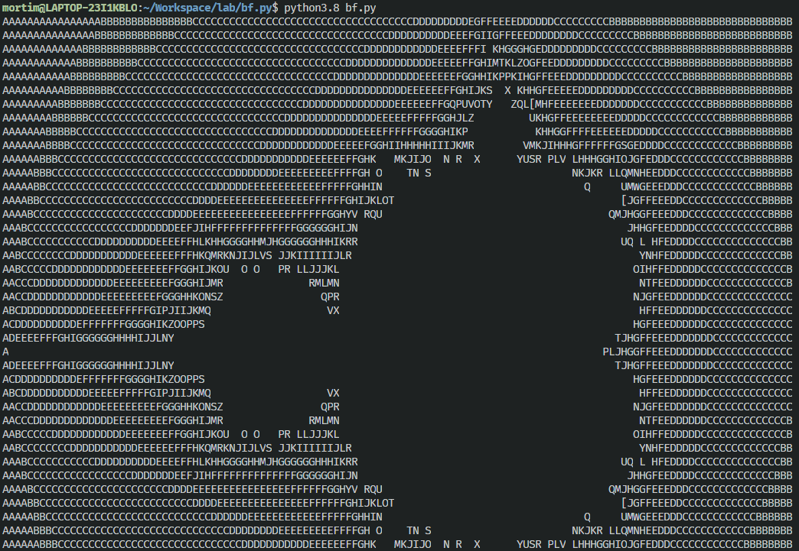

## bf

Brainfuck interpreter written in Python.

Pre-requesite:
    - python (>= 3.6)

```
python bf.py
```

In bf.py file:
```
execute(file.bf, input[optional])
```

You have to create brainfuck file.

### Examples

```
execute("examples/hello.bf", "")

# Output: Hello World!
```

```
execute("examples/input.bf", "hello")

# Output: hello
```

```
execute("examples/mandelbrot.bf", "")
# Output
```




